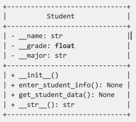
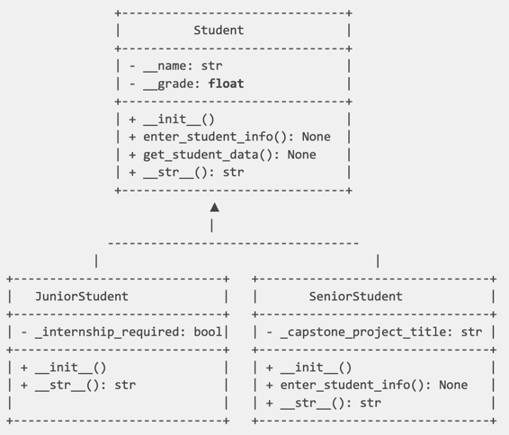

## Techniques for Designing a Class:
#### Programmers often draw a Unified Modeling Language class diagram - it represents a graphical view of your object-oriented program
#### The UML diagram is divided into three sections, 
#### Top section : class name 
#### Middle section: class data attributes
#### Bottom section: class methods

## UML Student class Diagram

## Class:
Blueprint for creating objects.
A class is code that specifies data attributes and methods for a particular type of object.

## Attributes: 
The class data,  attributes define what you need to know about the Student, name, grade, major
You set attributes to private, through data hiding, a form of Encapsulation. This protect your data from accidental corruption.
Prefix the variable with double underscore to depict as private __name, __grade, __major

## Methods:
Methods provide behavior or actions for the data.
Methods should always begin with verbs, action words, (i.e. get_grade(), enter_name())

## Inheritance:
Inheritance in the process of reusing code by deriving a new class from an existing one.
This new class inherits members of the class it extends.  
Inheritance can be defined as:

Super ---> Subclass

Parent ---> Child

Base ---> Derived

## The UML diagram depicts an "Is-a" Relationship:  

JuniorStudent Is-a Student

SeniorStudent Is-a Student

## File Handling and Data Interchange Formats in Python
### The second part of Unit4 Python OOP demonstrates how to handle files and work with CSV and JSON data using Python.
### File Object and open()
  File objects are created using open().

Modes: 'r', 'w', 'a', 'r+' (read and write).

           
r --> read file

           
w --> write to a file

           
a -->. append to the end of a file

           
r+ --> read and write to a file

Professor Lewis

Reference:  Starting out with Python 5th Edition, Tony Gaddis

          

